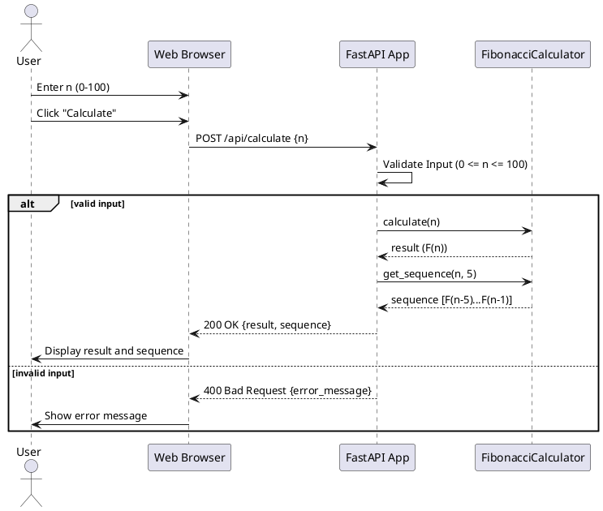
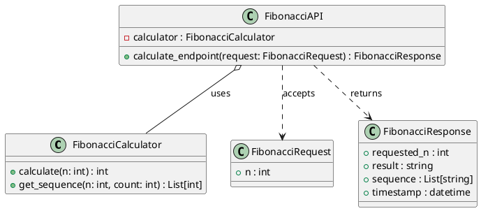

# Design: Fibonacci Web Calculator

## 1. System Architecture

사용자가 웹 브라우저를 통해 요청을 보내면, FastAPI 백엔드가 이를 수신하여 도메인 로직(Calculator)을 통해 계산한 뒤 결과를 반환하는 구조입니다.

### Sequence Diagram (PlantUML)

## 2. Class Design

객체지향 원칙을 준수하여 계산 로직을 캡슐화합니다.

### Class Diagram (PlantUML)

## 3. UI Layout Sketch

- **Header**: "Fibonacci Web Calculator"
- **Input Section**: 
  - Label: "Enter a number (0-100):"
  - Input: `[ Number Input ]`
  - Button: `[ Calculate ]`
- **Result Section**:
  - Main Display: "Result: F(n) = {result}"
  - Sequence Display: "Previous numbers: {F(n-5), ..., F(n-1)}"
- **Error Display**: Red text below input field for validation errors.
